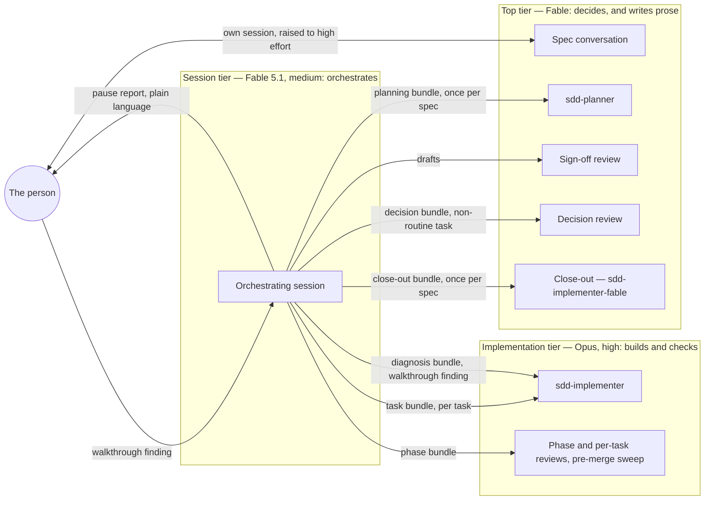

# Solowright

**Solowright** is a spec-driven development system for Claude Code,
built for a solo builder rather than a team. One person owns what the
product does: they write the spec and try the result. The system plans
it, builds it task by task on the right model for each job, reviews its
own work at fixed gates, and reports back in plain language. It is not
an enterprise platform and doesn't try to be. Every design choice in it
was measured on real projects, and the record of why is in the repo.

It is one thing to install: a Claude Skill named
`spec-driven-development` plus four subagent definitions. The skill
carries the process, the document templates a new project is
scaffolded from, the model policy, and the design record. There is no
separate project template to clone — the first session of a project
scaffolds it from the templates here, so every project starts from the
current ones. New to spec-driven development, or wondering why you'd
want it? `How-To-Use.md` in this repo is the human guide; this file
covers installing the skill and keeping it current.

**This repo is not itself read by Claude Code or claude.ai.** It's the
place changes get made and history gets kept; the skill only actually
functions once its contents are installed to the two places below.
Think of this repo as the source of truth you edit and periodically
sync outward, not a live location either tool reads from directly.

## What's here

```
SKILL.md                        AI-facing instructions — the file that
                                 actually gets loaded once installed
How-To-Use.md                   The human guide: starting and running a
                                 project, and what your part of it is
agents/                         The four subagent definitions. Installed
                                 to ~/.claude/agents/ — see "Installing"
  sdd-planner.md                Drafts plan.md and tasks.md, once per spec
  sdd-implementer.md            Builds one task per dispatch
  skeptical-reviewer.md         Sign-off, phase reviews, decision reviews,
                                 the pre-merge sweep
  sdd-implementer-fable.md      The close-out dispatch, and the optional
                                 stronger task implementer; same body as
                                 sdd-implementer, different frontmatter
project/                        A new project's skeleton, laid out exactly
                                 as it lands; the first session copies it
  CLAUDE.md                     Constitution skeleton
  .claude/settings.json         Session model and effort (Fable profile)
  .claude/settings.opus.json    The Opus profile's version; the
                                 scaffold keeps one of the two
  .github/PULL_REQUEST_TEMPLATE.md
  .gitignore
  specs/001-spec-name/          spec.md, plan.md, tasks.md skeletons
  design/brief.md               Design brief skeleton, for projects with a UI
references/
  collaboration-workflow.md     Full step-by-step version of the
                                 routine/subagent/escalate triage
  design-record.md              Decision record: the reasoning and
                                 history behind the skill's choices,
                                 kept out of what every session loads
```

`README.md` (this file) and `How-To-Use.md` are for humans — nothing in
this repo besides `SKILL.md`, `project/`, `references/`, and the
installed copies of `agents/` is read by either tool.

## The flow, in one paragraph

A project starts in Claude Code: an empty repository, one sentence,
and the first session scaffolds it from the skill's templates, then
hosts the idea, constitution, and first-spec conversations. Sessions
in the project open on the session tier at medium effort,
automatically. Each spec is a conversation in a Claude Code session of
its own, raised to high effort by the person
(the only manual choice in the workflow); once approved, that
same session dispatches the planner and the sign-off at the top tier,
then hands off to an implementation session on the session tier that
builds task by task through implementation-tier implementers and
per-phase reviews, sending any real design question back up to the
top tier rather than deciding it, pausing for the person after each
phase, and ending at the merge. Two session boundaries per spec. The full table — every step, where it
runs, on which model, who's talking — is "The flow at a glance" in
`SKILL.md`.

## Model tiers, and why the orchestrator sits on the top tier's model

Three roles, three tiers. The names are the current models; the roles
are what the skill actually fixes, and a project's `CLAUDE.md` names
the models once. The session tier runs the top tier's model at medium
effort; the reasoning and the measurement are below. Which tier each
dispatch actually runs at is a nine-row table in that same
`CLAUDE.md`, holding tier names rather than model IDs, so a project
can move one role without touching the others and a profile switch
re-points them all at once.

Which models fill the tiers is the first thing a new project asks:
Fable or Opus. The Fable profile is the one drawn below — Fable for
the judgment and the session seat, Opus 5.5 for implementation and
routine review. The Opus profile runs Opus 5.5 everywhere, every
dispatch at high effort and orchestration at medium, and never draws
on Fable's allowance.



The placement follows one rule: **the expensive model goes where the
decisions are concentrated, not where the turns are.** A Claude Code
session re-sends its entire context on every turn, and on measured
projects those re-sends were about 97% of all tokens. The
orchestrating session is the longest-lived context in the workflow
and takes the most turns, so whatever model sits there pays its
cache-read rate on everything, constantly. The planner, the sign-off,
and a decision review are the opposite shape: short-lived, dense with
judgment. So the top tier at high effort runs inside those dispatches,
and the session seat is priced by cache reads.

That only works if the orchestrator genuinely has no judgment calls
left. Every kind it could face has a defined route away from it:

| The call | Where it goes |
|---|---|
| How to build the spec | `sdd-planner`, then sign-off — top tier |
| A task that turns out not to be routine | Decision review — top tier; the session frames the question and transcribes the answer |
| Is the work correct | The constitution's verification command, then the reviewer — implementation tier |
| The person tried it and something is wrong | Diagnosis dispatch to the implementer; a fix comes back, or options go to a decision review |
| What the product should do | The person, as a spec question, before any code changes |
| Everything else — bundles, dispatch, verify, commit, report | The session |

What remains for the session is procedure, whose mistakes are cheap
and self-revealing (a bad bundle fails verification and costs one
re-dispatch) and don't compound. Medium effort is the behavioral half
of that: high effort makes a session investigate before acting, and
everything a hands-off orchestrator reads inflates every later
re-send.

Which model fills the session seat used to be constrained to "not
the top tier", on the assumption that the top tier charged a premium
on every re-send. Fable 5.1's cache reads bill at half the Opus rate,
which makes the seat's per-token cost about equal on either model.
Measured over five specs on three projects, the session on Fable 5.1
at medium cost about a third per task of the same seat on Opus 4.8,
and Fable's separate allowance held with three projects drawing at
once; the pause reports — the one seat whose prose the person reads —
read at least as well. The skill pairs that with a plain-language rule for everything
the person sees, under any model, and with a continuation prompt at
each of the two session boundaries, so a boundary costs a paste rather
than a reconstruction. A phase pause gets no prompt: it isn't a
boundary, and offering one there invites a context clear that costs a
full re-read.

The full decision record — what was measured, what was tried first,
and what evidence would change each choice — is
`references/design-record.md`.

## Starting a project

Create an empty repository, open Claude Code in it, and say "Start a
new Solowright project." The first session scaffolds the repo from
`project/` and walks through the idea, the constitution, and the first
spec; `How-To-Use.md` has the full sequence and what your part of it
is. Projects used to start from a separate template repo,
`solowright-template`; it is archived, because a copy of the templates
drifted from the originals within weeks — the design record has the
numbers.

## Installing

Two copies, two places — updating this repo doesn't propagate to
either automatically.

### Claude Code

Skills are only discovered from an exact location:
`~/.claude/skills/spec-driven-development/` (personal, every project on
this machine) or a project-level `.claude/skills/spec-driven-development/`
(that one repo only). Copy `SKILL.md`, `project/`, and `references/`
there directly — same folder structure as this repo, just at that path
instead.

The subagent definitions are a separate copy: all four files in
`agents/` go to `~/.claude/agents/` (user-level, every project on this
machine). Claude Code reads them from there, not from inside the skill
folder. All four are needed even by a project that never opts into the
stronger task implementer, because `sdd-implementer-fable` is also the
close-out dispatch under the Fable profile.

Verify it's actually recognized, not just present: open Claude Code
anywhere and ask what skills are available.

### claude.ai (optional)

Only needed if you like to think an idea through in chat before a repo
exists; nothing in the workflow depends on it. Settings → Capabilities
→ enable "Code execution and file creation"
(skills won't appear in the menu until this is on). Then zip `SKILL.md`,
`project/`, and `references/` together — the zip's root should be the
`spec-driven-development` folder itself, not the loose files and not an
extra wrapper folder around it. Settings → Customize → Skills → upload
the zip, toggle it on.

Verify with a fresh chat: ask what Solowright is and confirm it answers
from the skill rather than guessing.

## Updating

Edit here first, commit normally. Then manually re-sync the install
locations — copy the changed files to the Claude Code path, and re-zip
and re-upload for claude.ai if you use it. Nothing pushes automatically
to either; this repo having the fix doesn't mean an installed copy has
it yet. Projects already scaffolded keep the templates they started
with; only `CLAUDE.md`'s model policy is expected to be brought up to
date when the policy changes, and the skill says how.
