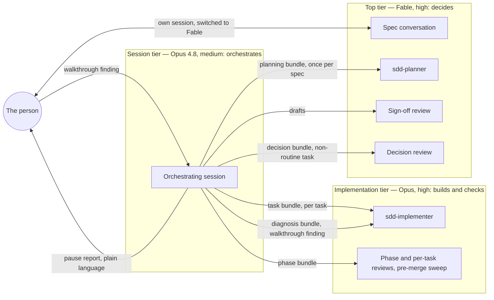

# Solowright

**Solowright** is a spec-driven development system for Claude Code,
built for a solo builder rather than a team. One person owns what the
product does: they write the spec and try the result. The system plans
it, builds it task by task on the right model for each job, reviews its
own work at fixed gates, and reports back in plain language. It is not
an enterprise platform and doesn't try to be. Every design choice in it
was measured on real projects, and the record of why is in the repo.

It comes in two parts:

- **This repo** is the system itself, packaged as a Claude Skill named
  `spec-driven-development`: the process, three subagent roles, the
  document templates, the model policy, and the design record.
  Installed once; applies to every project.
- **[`solowright-template`](https://github.com/EHaake/solowright-template)**
  is the project scaffold — a GitHub template repo that seeds a new
  project's `CLAUDE.md`, `spec.md`, `plan.md`, `tasks.md`, and
  `brief.md`. New to spec-driven development, or wondering why you'd
  want it? Its README and `How-To-Use.md` are the human guide; this
  one covers getting the skill installed and kept current.

**This repo is not itself read by Claude Code or claude.ai.** It's the
place changes get made and history gets kept; the skill only actually
functions once its contents are installed to the two places below.
Think of this repo as the source of truth you edit and periodically
sync outward, not a live location either tool reads from directly.

## What's here

```
SKILL.md                        AI-facing instructions — the file that
                                 actually gets loaded once installed
assets/
  CLAUDE-template.md            Constitution skeleton
  spec-template.md              spec.md skeleton
  plan-template.md              plan.md skeleton
  tasks-template.md             tasks.md skeleton
  design-brief-template.md      brief.md skeleton, for projects with a UI
  settings-template.json        .claude/settings.json a project gets at
                                 setup: session model and effort
  skeptical-reviewer.md         Source copy of the reviewer subagent —
                                 see "Installing" below for where the
                                 active copy actually lives
  sdd-implementer.md            Source copy of the implementer subagent
                                 — same install location as the reviewer
  sdd-planner.md                Source copy of the planner subagent —
                                 same install location
references/
  collaboration-workflow.md     Full step-by-step version of the
                                 routine/subagent/escalate triage
  design-record.md              Decision record: the reasoning and
                                 history behind the skill's choices,
                                 kept out of what every session loads
```

`README.md` (this file) and `How-To-Use.md`, if you keep a copy here,
are for humans — nothing in this repo besides `SKILL.md`, `assets/`, and
`references/` is read by either tool.

## The flow, in one paragraph

A project starts in chat, at the top tier: the idea, the constitution
(which also writes the project's `.claude/settings.json`), and the first
spec, plan, and tasks — nothing has a codebase yet. From then on,
Claude Code sessions in the project open on the session tier at
medium effort, automatically. Each later spec is a conversation in a
Claude Code session of its own, switched to the top tier by the person
(the only manual model choice in the workflow); once approved, that
same session dispatches the planner and the sign-off at the top tier,
then hands off to an implementation session on the session tier that
builds task by task through implementation-tier implementers and
per-phase reviews, sending any real design question back up to the
top tier rather than deciding it, pausing for the person after each
phase, and ending at the merge. Two session boundaries per spec. The full table — every step, where it
runs, on which model, who's talking — is "The flow at a glance" in
`SKILL.md`.

## Model tiers, and why the orchestrator isn't the top one

Three roles, three tiers. The names are the current models; the roles
are what the skill actually fixes, and a project's `CLAUDE.md` names
the models once.



The placement follows one rule: **the expensive model goes where the
decisions are concentrated, not where the turns are.** A Claude Code
session re-sends its entire context on every turn, and on measured
projects those re-sends were about 97% of all tokens. The
orchestrating session is the longest-lived context in the workflow
and takes the most turns, so whatever model sits there pays its rate
on everything, constantly. The planner, the sign-off, and a decision
review are the opposite shape: short-lived, dense with judgment. So
the top tier runs inside those dispatches and nowhere else.

That only works if the orchestrator genuinely has no judgment calls
left. Every kind it could face has a defined route away from it:

| The call | Where it goes |
|---|---|
| How to build the spec | `sdd-planner`, then sign-off — top tier |
| A task that turns out not to be routine | Decision review — top tier; the session frames the question and transcribes the answer |
| Is the work correct | The constitution's verification command, then the reviewer — implementation tier |
| The person tried it and something is wrong | Diagnosis dispatch to the implementer; a fix comes back, or options go to a decision review |
| What the product should do | The person, as a spec question, before any code changes |
| Everything else — bundles, dispatch, verify, commit, report | The session |

What remains for the session is procedure, whose mistakes are cheap
and self-revealing (a bad bundle fails verification and costs one
re-dispatch) and don't compound. That bounded cost is traded against
a tier premium on every turn. Medium effort is the same reasoning
applied to behavior: high effort makes a session investigate before
acting, and everything a hands-off orchestrator reads inflates every
later re-send.

Which model fills the session seat is the person's choice, within
one constraint: not the top tier. It's the one seat whose prose the
person reads — the pause report — so readability counts there and
nowhere else. The current pick is Opus 4.8, a previous-generation
model at the implementation tier's rate, chosen because its reports
read most clearly to the person running these projects. The skill
pairs that with a plain-language rule for everything the person sees,
under any model, and with a continuation prompt at every
session-ending pause, so that each session boundary costs a paste rather
than a reconstruction.

The full decision record — what was measured, what was tried first,
and what evidence would change each choice — is
`references/design-record.md`.

## Installing

Two separate installs, two separate places — updating this repo doesn't
propagate to either automatically.

### Claude Code

Skills are only discovered from an exact location:
`~/.claude/skills/spec-driven-development/` (personal, every project on
this machine) or a project-level `.claude/skills/spec-driven-development/`
(that one repo only). Copy `SKILL.md`, `assets/`, and `references/` there
directly — same folder structure as this repo, just at that path instead.

The three subagent definitions are a separate copy:
`assets/skeptical-reviewer.md`, `assets/sdd-implementer.md`, and
`assets/sdd-planner.md` go to `~/.claude/agents/` (user-level, every
project on this machine). Claude Code reads them from there, not from
inside the skill folder.

Verify it's actually recognized, not just present: open Claude Code
anywhere and ask what skills are available.

### claude.ai

Settings → Capabilities → enable "Code execution and file creation"
(skills won't appear in the menu until this is on). Then zip `SKILL.md`,
`assets/`, and `references/` together — the zip's root should be the
`spec-driven-development` folder itself, not the loose files and not an
extra wrapper folder around it. Settings → Customize → Skills → upload
the zip, toggle it on.

Verify with a fresh chat: ask it to start a new SDD project and confirm
it references the methodology unprompted.

## Updating

Edit here first, commit normally. Then manually re-sync both install
locations — copy the changed files to the Claude Code path, re-zip and
re-upload for claude.ai. Nothing pushes automatically to either; this
repo having the fix doesn't mean either installed copy has it yet.

## The companion repo

**[`solowright-template`](https://github.com/EHaake/solowright-template)**
is the project-scaffold counterpart — a GitHub template
repo (the actual "Template repository" feature) that seeds a new
project's `CLAUDE.md`/`spec.md`/`plan.md`/`tasks.md`/`brief.md`. This
repo and that one are deliberately separate: this one is the
methodology, installed once, applying to every project; that one is a
starting point, cloned fresh per project, with no ongoing link back to
either this repo or itself once used.
