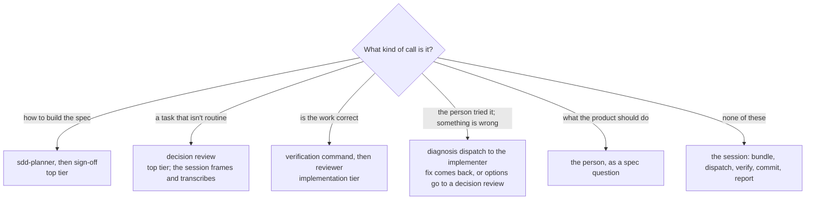

# Design record: why the skill is shaped the way it is

The decision record for the skill's less obvious choices — the
reasoning and the history, kept out of `SKILL.md` so that what every
session loads is the process, not its archaeology. Nothing here is
needed to *apply* the skill. Read it when a choice is being revisited,
or when a project's evidence makes one look wrong.

Origin: the methodology was refined across one full project build (an
iOS app, from blank repo to a working, tested, CloudKit-synced v1) and
then adopted by several more. Nothing in the skill is specific to that
app. "The reference project" below means that first one.

---

## Model tiering: three tiers, and why the session is the lowest

### The rule

Put the expensive model where the *decisions* are concentrated, not
where the *turns* are. Everything in this section follows from that
one rule and the measurement that motivated it.

A Claude Code session re-sends its whole context on every turn. On
the measured projects, those cache re-sends were about 97% of all
tokens; thinking and output were the rest. So the cost of a role is,
to a first approximation, the size of its context times the number
of turns it takes — and the model's rate multiplies both. The roles
in the workflow have very different shapes:

| Role | Context lifetime | Turns | Judgment per turn |
|---|---|---|---|
| Orchestrating session | a whole phase, many tasks | many per task: bundle, dispatch, read report, verify, commit, tick, review, read verdict | almost none — procedure |
| `sdd-implementer` | one task, then discarded | a handful | low — transcription of a settled plan |
| Reviewer, per phase / per task | one bundle, then discarded | a few | moderate — checking a diff against a plan |
| `sdd-planner` | one spec's planning, then discarded | tens | high — the architecture |
| Sign-off, decision review | one bundle, then discarded | a few | high — the judgment calls |
| Spec conversation | its own session | a conversation | high — product intent |

The top tier belongs in the bottom three rows. The session, with the
most turns and the least judgment, belongs on the cheapest tier that
can follow a written protocol. That is the whole design; the rest is
making sure the "least judgment" claim is actually true.

### Every judgment call has a route away from the session

Each route was added when a gap showed the session improvising:

- **Design** was never the session's: the planner and the sign-off
  came in with the authorship transition (below).
- **Non-routine tasks** were originally researched and proposed in
  the session (Plan Mode), with the reviewer checking the proposal.
  That was the one place the session did design work, and it was
  closed when the session moved to the third tier: the session now
  frames a decision bundle and the reviewer at the top tier
  recommends, in a third invocation type added to its definition.
- **Correctness** is the verification command plus the reviewer, and
  the loop rules (verify by running, open the diff only on failure,
  never fold in second-look notes by hand) keep the session from
  re-doing that work itself.
- **Walkthrough findings** had no path at all until the person asked
  what happens when they report that something looks wrong at a
  phase pause. The session was left to diagnose in place — a
  judgment the tiering exists to keep off it, under any model. The
  path added: restate (session), diagnose in a dispatch (implementer,
  which gained a diagnosis mode), route the return.
- **Product questions** were always the person's; the escalation
  triggers and the planner's and reviewer's "needs the person"
  verdict are how they get there.

### Why "a stronger orchestrator makes fewer mistakes" doesn't win

That argument is sound wherever the orchestrator makes judgment calls
whose errors compound. With the routes above in place, what the
session has left is procedure — build the bundle, follow the verdict,
commit, don't edit `tasks.md` from a stale copy, don't do the task
itself. Procedural errors are cheap and self-revealing: a badly
assembled bundle fails verification or comes back "fix and
re-review", and the cost is one extra dispatch. They don't compound
into a wrong architecture, because the architecture was decided
somewhere the top tier did look.

So the trade is a bounded, occasional re-dispatch against a tier
premium applied to every turn of every task. That favors the lowest
tier that holds the protocol — and "holds the protocol" is the thing
not yet measured. The cost side of this decision comes from data; the
quality side comes from design intent. The tier log's "miss reason"
column is where the quality side gets tested.

### What the measurement showed

On the first specs measured under the policy, with the top tier
orchestrating:

- Cache reads were about 97% of all tokens.
- The orchestrating session's re-send volume was eight to nine times
  the implementers' combined.
- A later spec cost more than an earlier one of similar size even
  after the implementer layer got cheaper. The orchestrator was where
  the savings were being spent.
- The top tier has its own usage allowance, and the orchestrator was
  consuming most of it — 82% of the weekly allowance at one point, on
  the role that needs it least.

That moved the session from the top tier to the implementation tier.

### Then one tier further: the session below the implementation tier

Shortly after, the session moved from the implementation tier (Opus)
to a third, lower tier (Sonnet), for two reasons that reinforce each
other:

- **The same argument, applied again.** Once every judgment call is
  routed off the orchestrator, there is no role-based reason for it
  to sit on the implementation tier either. The one remaining
  exposure — non-routine tasks designed in the session — was closed
  at the same time (see the routes above). With that done, the
  session tier does nothing that needs Opus.
- **Readability of what the person reads.** At the product-owner
  level the pause report is the whole interface between the person
  and the build, and the person found Opus 5's prose hard to read —
  jargon-heavy, unusual word choices and sentence shapes. That is a
  defect in the orchestrator role, not a cosmetic one, so "which model
  writes clearly for this person" is a legitimate selection criterion
  for this seat specifically. A plain-language rule for reports was
  added to the constitution template at the same time, since it
  applies to any model.

Cost follows: cache reads on every orchestrator turn bill at the
lower rate and draw less on the allowance. The `sdd-planner`
definition changed from `model: inherit` to `model: opus` at the same
time, so that the top-tier fallback lands on the implementation tier
rather than the session tier.

### And then sideways: Opus 4.8, the person's choice

Before any spec ran on Sonnet, the session moved again — to Opus 4.8,
at the same medium effort. The deciding factor was the one the
previous move had surfaced: the session seat is the only place whose
prose the person reads, and of the available models Opus 4.8's
reports read most clearly to them. The cost difference between
Sonnet and Opus on the session's re-sends was judged not to matter on
the person's plan (a Max 20x subscription), which removed the reason
to prefer Sonnet; the allowance argument below is about the top
tier's separate budget, not about Opus versus Sonnet.

What survives from the Sonnet move is the structural part: the
session still never resolves a design question (the decision-review
route stays), still gets a plain-language rule for reports, and still
runs at medium. What changed is the answer to "which model, given
that it doesn't need to be the top tier" — and the record now treats
that as a per-person choice rather than a cost-derived one. Sonnet
stays on the list as the lever to pull if the session's share of the
allowance ever becomes the constraint.

Two settings details: a previous-generation model has no short alias
in Claude Code's settings, so the template pins the full ID
`claude-opus-4-8`, and the implementer and reviewer stay on `opus`,
which resolves to the current generation — so the session and the
implementation tier are different models at the same rate.

### The allowance argument

The top tier's allowance is the scarcest budget in the workflow, and
the person asked that anything the top tier handles be able to fall
back when it runs out. With the top tier confined to the planner, the
sign-off, decision reviews, and the spec conversation — all short —
the fallback is a one-line change (drop the override on the
dispatches; both agent definitions default to the implementation
tier), not a mid-spec model switch in a long-running session.
Experiment 1 (below) puts the session on the top tier's model and so
accepts exactly that switch as its fallback; needing it is one of
the experiment's results.

### Why medium rather than high

Effort mainly changes how much the model reasons and explores before
acting. For a dispatch loop that is supposed to be hands-off, high
effort pulls the wrong way: it tends to read files itself and
deliberate over things it should delegate, and everything it reads
inflates the context that every later turn re-sends. Medium is the
"do the procedure, don't investigate" setting. The subagent
definitions carry `effort: high`, so implementation, review, and
planning still reason at full strength inside their own short
contexts.

This is the least evidence-backed piece of the policy. Output tokens
were a few percent of the total, so the direct saving from medium is
small; the argument is behavioral, and plausible rather than measured.

### What would change the decision, and in what order

1. **A tier log showing procedural misses by the session** — bundles
   that missed a file the implementer needed, a review skipped, a
   stale `tasks.md` edit, an escape hatch taken on a task that was
   actually well-specified, a walkthrough finding diagnosed in place.
   First fix: the session at **high** effort. One line in the
   project's `.claude/settings.json` (`effortLevel`), and in
   `assets/settings-template.json` if it should become the default.
2. **Misses that persist at high effort** — then the current-generation
   Opus as the session, for one spec of similar size, with the
   `ccusage session --breakdown` comparison afterward. Running the
   experiments in this order says whether the problem was effort or
   model, instead of guessing at both.
3. **The session's share of the allowance becoming the constraint** —
   then Sonnet as the session, same measurement. This is the cost
   lever, and it has not been exercised.
4. **The top tier as the session** only if the misses persist through
   all of the above.
5. **A policy change that hands the session judgment calls again** —
   for example, if triage were ever widened so the session resolved
   design questions inline rather than sending them to a decision
   review. That would restore the "fewer mistakes" argument and the
   tier should follow.

Absent one of those, the choice stands.

### Status

Decided September 2026, after two measured specs on the top tier and
none yet on any session tier below it. Cost side measured; quality
side untested. The next spec's tier log is the first evidence either
way. Superseded for one spec by experiment 1, below, which tests a
cost premise this section took for granted.

### Experiment 1: the session on the top tier's model, at medium

**The premise that changed.** Everything above prices the session
seat as "the model's rate times every re-send", as if a tier's rate
were one number. It isn't. Re-sends bill at the cache-read rate, and
Fable 5.1 cut that rate to a quarter of Fable 5's. Per million
tokens:

| Model | Input | Output | Cache read | Cache write (5-min) |
|---|---|---|---|---|
| Fable 5.1 | $10 | $50 | $0.25 | $12.50 |
| Fable 5 | $10 | $50 | $1.00 | $12.50 |
| Opus 5 / Opus 4.8 | $5 | $25 | $0.50 | $6.25 |
| Sonnet 5 | $2 | $10 | $0.20 | $2.50 |

At the traffic mix this record measured — cache reads about 97% of
tokens — the two seats cost about the same per million tokens sent:

| Mix (read / write / output) | Opus 4.8 | Fable 5.1 |
|---|---|---|
| 97% / 2% / 1% | $86 | $99 |
| 98% / 1.5% / 0.5% | $70 | $68 |

So "a tier premium on every turn" is no longer true of the top
tier's model on the traffic that dominates. The record above does not
say which Fable the 82%-of-allowance figure was measured on, or what
cache-read rate it assumed; if it was Fable 5, that seat's re-sends
cost four times what they would today. Public write-ups of Fable 5.1
workflows (September 2026) reach the same arithmetic — per token,
back to what Opus alone cost — and run Fable 5.1 as the orchestrator
with the same context discipline this skill already has: bundles,
short returns, scratch files, handoff documents.

**What stays fixed.** One variable changes. The routes away from the
session stay exactly as drawn above — the session still frames a
decision bundle rather than deciding, still never diagnoses in place
— even though a top-tier session could plausibly take those calls
back. Simplifying the routes is a later experiment, once this one has
a number. The planner stays a dispatch regardless of outcome; its
reason is context, not tier. Medium effort stays for the behavioral
reason above.

**Hypotheses.** (1) Dollar cost per spec, from `ccusage session
--breakdown`, lands within about 15% of the same spec on Opus 4.8.
(2) The draw on Fable's separate allowance over one spec is small
enough that the allowance is not the constraint — the number to
watch, since the allowance's weighting of cache reads is not
published and could not be verified. (3) The pause reports read at
least as clearly as Opus 4.8's did, by the person's judgment.
(4) The tier log shows no more procedural misses than before.

**Protocol.** One spec, on a project whose previous spec ran under
the current loop rules.

1. Before the spec session opens, the person notes the Fable
   allowance reading from the usage page. The tier log gets a header
   row: experiment 1, session `claude-fable-5-1` at medium, the date,
   the allowance at start.
2. The spec runs exactly as `SKILL.md` on this branch says. Every
   dispatch logs its resolved model as usual. If the allowance runs
   out and the session falls back to `claude-opus-4-8`, the tier log
   records the turn it happened at; that is a result, not a failure.
3. At the merge, the person notes the allowance reading again, runs
   `ccusage session --breakdown`, and writes both into the tier log
   with a one-line verdict on how the pause reports read.
4. Compare against the most recent spec of similar size on `main`.
   If none has yet run on Opus 4.8 under the same loop rules, the
   next spec on `main` is the control, and the comparison waits for
   it.

**Decision rule.** All four hold: merge the branch; the session tier
becomes Fable 5.1 at medium, and the next experiment tests the
implementer on Fable 5.1 at medium against Opus at high, judged per
completed task including review rounds. The allowance is the
constraint: keep `main`, and record the allowance draw per spec so
the weighting is known. Reports read worse: the session tier is the
person's choice of prose, and the record above already says so —
keep `main`, note the finding. Procedural misses rise: unexpected
under a stronger model; investigate before concluding anything.

**Applying it to a project.** The session that opens a project for
this experiment is given the prompt below; it updates the two files
the model policy lives in and starts the log. Paste it into a fresh
session in the project, with this branch installed as the skill.

> Experiment 1 setup for this project. Rewrite `.claude/settings.json`
> from the installed skill's `assets/settings-template.json`
> (session model `claude-fable-5-1` at medium effort). In `CLAUDE.md`,
> replace the "Model policy" section with the one in the installed
> skill's `assets/CLAUDE-template.md`, keeping this project's
> involvement level and anything project-specific the old section
> carried. Add a header row to the current spec's tier log in
> `tasks.md` (or the next spec's, if none is open): experiment 1,
> session `claude-fable-5-1` at medium, today's date, and the Fable
> allowance reading I give you. Commit the three files in one commit
> with a message that says which experiment and which branch of the
> skill this project now follows. Then stop and show me `/effort
> status`; don't start any spec work in this session.

## Tiering by role at execution time, not by a table written in advance

The reference project's first attempt at model tiering assigned a model
and effort per task, predicted up front from the foundational-vs-
mechanical split in `tasks.md`. It was abandoned: several tasks
assumed safely mechanical benefited from the top tier in ways nobody
saw coming, and a static table had no way to notice. The failure mode
was a lighter model quietly doing a worse job on a task that looked
mechanical — and the table gave that failure zero catches.

The current policy tiers by *role*, decided per task at dispatch time,
and gives the same failure three independent catches: the orchestrator
reads every task before dispatching and every report that comes back
(Step 1 triage); the implementer is under a standing rule to stop and
return the moment it hits a judgment call rather than resolve it; and
the reviewer sits at every phase boundary and on every marked task.
The escape hatch — the orchestrator does the task itself after two
failed verifications or a spurious "judgment call" return, and logs
the miss — is the surviving form of the original lesson: a tier
assignment is a guess to verify, and the misses are the data.

## The first measurement went the wrong way

The first specs measured under the tiering policy cost *more* than the
single-session regime that preceded it, not less. Each cause became a
rule in `SKILL.md`'s loop:

| What happened | The rule it produced |
|---|---|
| An unbounded fix-and-re-review loop in which a cold reviewer found a new objection every round; over half of one spec's subagent tokens sat in four tasks' loops (one task took five rounds) | One review and at most one re-review per invocation; blocking defined narrowly; the re-review sees only the findings and the fix diff |
| Implementers and the orchestrator ingesting raw build and test logs | The constitution names one filtered verification command, run verbatim |
| The orchestrator re-running every verification and reading every diff at the top tier | Verify by running the command, not by reading; open the diff only on failure |
| A whole-codebase pre-merge sweep at the top tier | The sweep is bounded to documents plus the spec's diff, one tier down |
| One orchestrator session accumulating several specs' worth of context, spec conversations included | Spec conversations in their own session; per-phase `/clear` at first, later relaxed to two session boundaries per spec (see "Session boundaries" below) |
| "Folded in by the orchestrator" and "seen by the orchestrator" recurring as tier-log entries — the orchestrating session doing work the tiering exists to move off it | The orchestrator does not implement second-look notes or do visual verification by hand |
| The reviewer, at the top tier and reading the codebase fresh, costing about twice the implementation it reviewed | Reviewer defaults one tier down; every review scoped to a bundle |

The rollback condition written into `SKILL.md` follows from this: the
structural argument for dispatch — cheaper rates on the bulk of the
work, small fresh contexts — holds only while the coordination
overhead stays smaller than what it replaces. If a spec measured under
all of the rules above still loses to the single-session regime on the
top tier's budget, the implementer layer goes and the reviewer changes
stay.

## Session boundaries: two per spec, not one per phase

The per-phase `/clear` came out of the measurement above: cache
re-sends were 97% of tokens, so drop the carried context wherever it
had the least remaining value, and a phase boundary looked like that
place. In practice it produced a reset prompt at nearly every stage —
after picking the next spec, after the spec conversation, after
sign-off, after every phase — and the person found that too much.

Their diagnosis of the measured sessions, on reflection: the re-send
volume came from one orchestrator holding several specs' worth of
context, spec conversations included, and from the orchestrator doing
work itself at the top tier — not from one spec's phases accumulating
in one session. Under the dispatch policy, the orchestrator's own
context per spec is bookkeeping: bundles it wrote to files, short
subagent returns, `tasks.md` edits, pause reports. The exploration,
diffs, and logs that made the old sessions large now live in the
subagents' contexts and are discarded with them. A per-phase clear
was therefore buying a small reduction against a fixed cost: a
re-read of the constitution and the three spec files on every resume,
a paste by the person, and the loss of whatever the orchestrator had
in mind between phases.

The rule became two boundaries per spec, placed where the carried
context is genuinely large and genuinely spent: after `plan.md` and
`tasks.md` are final (the spec conversation is the biggest single
context in the workflow, and the files now hold everything it
decided), and after the merge (one spec's implementation has no value
to the next spec's conversation). Both are new sessions rather than
`/clear`, because the model changes at each: the spec session runs at
the top tier, implementation at the session tier, and the next spec
session has to open on the session tier to prompt for the switch.
`/clear` left the workflow entirely; `/compact` remains for an
implementation session that grows large.

A consequence accepted knowingly: the spec session now also runs
planning, so its few orchestrating turns — bundle assembly, two
dispatches, the spec-conformance summary — run at the top tier, at
high effort, over the spec conversation's context. That is a handful
of turns against a whole session boundary saved, and it puts the
planner's and reviewer's "needs the person" returns in front of the
person who just wrote the spec, with the conversation still open.

Decided September 2026, on the person's experience of the reset
cadence rather than on a measurement. The next spec's `ccusage
session --breakdown` is the check: if the implementation session's
re-send volume grows to rival what the per-phase clears were saving,
the phase boundary comes back as an optional clear at the person's
call, not as the default.

## Review cadence: why per-phase everywhere

The cadence used to be per-task throughout foundational phases — a
rule from when the person's attention was the scarce resource and a
per-task look at foundational work cost nothing else. With a
token-priced reviewer it did cost: on the first measured specs, review
ran about twice the implementation it reviewed, and a foundational
phase is short by construction, so its per-phase review comes a day
later rather than the same afternoon, with the pre-merge sweep still
behind it. Per-task review became the exception the planner marks
(`review: per-task`) for a genuinely expensive-to-unwind contract, not
a phase-wide rule.

## Involvement level: why product owner is the default

The skill's original shape had the person approving `plan.md` and
`tasks.md` and pausing after every foundational task — what is now the
technical-lead level. Across the projects the skill has run on, a
person who set out not to touch code turned out not to want to approve
architecture either: the per-task pauses became a report glanced at
and a button pressed, which is worse than no gate because it looks
like review without being one. Product owner became the default, with
the reviewer taking the technical gates and the person keeping the
spec, the attestation at phase pauses, and the escalation triggers.

## Plan and tasks authorship: why it moved to Claude Code

Originally chat authored `plan.md` and `tasks.md` for every spec, in
the same conversation that wrote the spec. That is right for a first
spec, whose plan invents an architecture with nothing to inspect. Once
shipped code is what a plan extends, chat can only see it through a
manually uploaded snapshot that starts subtly stale and drifts from
there; the workaround in practice was a relay — Claude Code prints
state into chat, chat authors the plan against the paste — a
transcription layer whose only function was preserving a rule written
for a condition that no longer held. Drafting moved to the
`sdd-planner`, dispatched once per spec on a planning bundle at the
top tier, so the code exploration a plan needs happens in a
discardable context rather than in the session that carries it into
implementation. Two risks were weighed and judged covered: a planner
with the code open anchoring on what is easy to build (the
skeptical-reviewer's sign-off and the spec-as-contract catch it), and
a product decision being settled silently in `plan.md` (the planner's
standing rule sends it back to the person). `spec.md` stayed a
conversation with the person in both phases — moved to a dedicated
Claude Code session, at the top tier, once chat's reason to exist
(no codebase) was gone.

## The name: Solowright, and why "system" rather than "skill" or "operating system"

Decided September 2026. The project had outgrown "a Claude Skill": by
then it was the skill, three subagent roles, a document set with
templates, a model policy with settings, a measured cost model, a
design record with rollback conditions, and a project-template repo.
Several coordinated parts that turn a spec into reviewed software is a
*system*. Comparable projects were calling themselves an "operating
system for AI-assisted development"; that was judged an overstatement
— an operating system would manage any kind of AI work generally, and
this is one workflow, with roles, for one kind of work — and the
positioning was set to be accurate rather than loud.

Two things go in the first sentence wherever the project is
introduced: it is built for a **solo builder**, not a team or an
enterprise, and the person is a **product owner** who writes the spec
and tries the result rather than reading code. Those are what set it
apart from the crowded spec-driven-development space, so they lead.

The name came from a brainstorm across three rounds, each checked
against GitHub for collisions. The first choice, Specwright, was
already used by two other spec-driven-development plugins for Claude
Code; every "spec + craft word" combination (Specsmith, SpecForge,
SpecLoom, SpecFoundry, Planwright, Buildwright) and every classic
trade name (Shipwright, Millwright, Wheelwright) was taken too, most
in this niche. Solowright — a *wright* for the *solo* builder — was
clean and says the audience in the name. Runners-up, also clean:
Ownwright (owner, "in your own right", wright), Truewrought, and
Wellwrought. The skill's installed name stays
`spec-driven-development` for now, since that is the tooling name
Claude Code triggers on and renaming it would mean a reinstall on
every machine.
