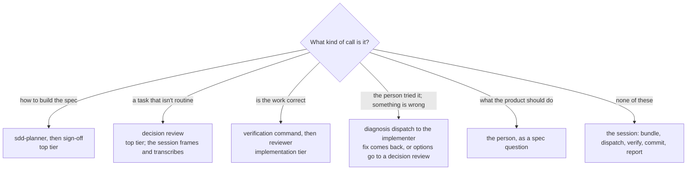

# Design record: why the skill is shaped the way it is

The decision record for the skill's less obvious choices — the
reasoning and the history, kept out of `SKILL.md` so that what every
session loads is the process, not its archaeology. Nothing here is
needed to *apply* the skill. Read it when a choice is being revisited,
or when a project's evidence makes one look wrong.

Origin: the methodology was refined across one full project build (an
iOS app, from blank repo to a working, tested, CloudKit-synced v1) and
then adopted by several more. Nothing in the skill is specific to that
app. "The reference project" below means that first one.

---

## Model tiering: three tiers, and why the session was the lowest

> **Superseded, 2026-09-14.** Experiment 1 moved the session to the top
> tier's model at medium effort; the reasoning below is why it started
> at the bottom, and the cost premise it rests on turned out to be
> wrong — Fable 5.1's cache reads bill at half the Opus rate. Read it
> as the argument that was tested, not as current policy. "Experiment
> 1: results" has what replaced it, and the constitution's role table
> is where the answer lives now.

### The rule

Put the expensive model where the *decisions* are concentrated, not
where the *turns* are. Everything in this section follows from that
one rule and the measurement that motivated it.

A Claude Code session re-sends its whole context on every turn. On
the measured projects, those cache re-sends were about 97% of all
tokens; thinking and output were the rest. So the cost of a role is,
to a first approximation, the size of its context times the number
of turns it takes — and the model's rate multiplies both. The roles
in the workflow have very different shapes:

| Role | Context lifetime | Turns | Judgment per turn |
|---|---|---|---|
| Orchestrating session | a whole phase, many tasks | many per task: bundle, dispatch, read report, verify, commit, tick, review, read verdict | almost none — procedure |
| `sdd-implementer` | one task, then discarded | a handful | low — transcription of a settled plan |
| Reviewer, per phase / per task | one bundle, then discarded | a few | moderate — checking a diff against a plan |
| `sdd-planner` | one spec's planning, then discarded | tens | high — the architecture |
| Sign-off, decision review | one bundle, then discarded | a few | high — the judgment calls |
| Spec conversation | its own session | a conversation | high — product intent |

The top tier belongs in the bottom three rows. The session, with the
most turns and the least judgment, belongs on the cheapest tier that
can follow a written protocol. That is the whole design; the rest is
making sure the "least judgment" claim is actually true.

### Every judgment call has a route away from the session

Each route was added when a gap showed the session improvising:

- **Design** was never the session's: the planner and the sign-off
  came in with the authorship transition (below).
- **Non-routine tasks** were originally researched and proposed in
  the session (Plan Mode), with the reviewer checking the proposal.
  That was the one place the session did design work, and it was
  closed when the session moved to the third tier: the session now
  frames a decision bundle and the reviewer at the top tier
  recommends, in a third invocation type added to its definition.
- **Correctness** is the verification command plus the reviewer, and
  the loop rules (verify by running, open the diff only on failure,
  never fold in second-look notes by hand) keep the session from
  re-doing that work itself.
- **Walkthrough findings** had no path at all until the person asked
  what happens when they report that something looks wrong at a
  phase pause. The session was left to diagnose in place — a
  judgment the tiering exists to keep off it, under any model. The
  path added: restate (session), diagnose in a dispatch (implementer,
  which gained a diagnosis mode), route the return.
- **Product questions** were always the person's; the escalation
  triggers and the planner's and reviewer's "needs the person"
  verdict are how they get there.

### Why "a stronger orchestrator makes fewer mistakes" doesn't win

That argument is sound wherever the orchestrator makes judgment calls
whose errors compound. With the routes above in place, what the
session has left is procedure — build the bundle, follow the verdict,
commit, don't edit `tasks.md` from a stale copy, don't do the task
itself. Procedural errors are cheap and self-revealing: a badly
assembled bundle fails verification or comes back "fix and
re-review", and the cost is one extra dispatch. They don't compound
into a wrong architecture, because the architecture was decided
somewhere the top tier did look.

So the trade is a bounded, occasional re-dispatch against a tier
premium applied to every turn of every task. That favors the lowest
tier that holds the protocol — and "holds the protocol" is the thing
not yet measured. The cost side of this decision comes from data; the
quality side comes from design intent. The tier log's "miss reason"
column is where the quality side gets tested.

### What the measurement showed

On the first specs measured under the policy, with the top tier
orchestrating:

- Cache reads were about 97% of all tokens.
- The orchestrating session's re-send volume was eight to nine times
  the implementers' combined.
- A later spec cost more than an earlier one of similar size even
  after the implementer layer got cheaper. The orchestrator was where
  the savings were being spent.
- The top tier has its own usage allowance, and the orchestrator was
  consuming most of it — 82% of the weekly allowance at one point, on
  the role that needs it least.

That moved the session from the top tier to the implementation tier.

### Then one tier further: the session below the implementation tier

Shortly after, the session moved from the implementation tier (Opus)
to a third, lower tier (Sonnet), for two reasons that reinforce each
other:

- **The same argument, applied again.** Once every judgment call is
  routed off the orchestrator, there is no role-based reason for it
  to sit on the implementation tier either. The one remaining
  exposure — non-routine tasks designed in the session — was closed
  at the same time (see the routes above). With that done, the
  session tier does nothing that needs Opus.
- **Readability of what the person reads.** At the product-owner
  level the pause report is the whole interface between the person
  and the build, and the person found Opus 5's prose hard to read —
  jargon-heavy, unusual word choices and sentence shapes. That is a
  defect in the orchestrator role, not a cosmetic one, so "which model
  writes clearly for this person" is a legitimate selection criterion
  for this seat specifically. A plain-language rule for reports was
  added to the constitution template at the same time, since it
  applies to any model.

Cost follows: cache reads on every orchestrator turn bill at the
lower rate and draw less on the allowance. The `sdd-planner`
definition changed from `model: inherit` to `model: opus` at the same
time, so that the top-tier fallback lands on the implementation tier
rather than the session tier.

### And then sideways: Opus 4.8, the person's choice

Before any spec ran on Sonnet, the session moved again — to Opus 4.8,
at the same medium effort. The deciding factor was the one the
previous move had surfaced: the session seat is the only place whose
prose the person reads, and of the available models Opus 4.8's
reports read most clearly to them. The cost difference between
Sonnet and Opus on the session's re-sends was judged not to matter on
the person's plan (a Max 20x subscription), which removed the reason
to prefer Sonnet; the allowance argument below is about the top
tier's separate budget, not about Opus versus Sonnet.

What survives from the Sonnet move is the structural part: the
session still never resolves a design question (the decision-review
route stays), still gets a plain-language rule for reports, and still
runs at medium. What changed is the answer to "which model, given
that it doesn't need to be the top tier" — and the record now treats
that as a per-person choice rather than a cost-derived one. Sonnet
stays on the list as the lever to pull if the session's share of the
allowance ever becomes the constraint.

Two settings details: a previous-generation model has no short alias
in Claude Code's settings, so the template pins the full ID
`claude-opus-4-8`, and the implementer and reviewer stay on `opus`,
which resolves to the current generation — so the session and the
implementation tier are different models at the same rate.

### The allowance argument

The top tier's allowance is the scarcest budget in the workflow, and
the person asked that anything the top tier handles be able to fall
back when it runs out. With the top tier confined to the planner, the
sign-off, decision reviews, and the spec conversation — all short —
the fallback is a one-line change (drop the override on the
dispatches; both agent definitions default to the implementation
tier), not a mid-spec model switch in a long-running session.
<!-- As of 2026-09-19 the top tier also holds the session seat and the
close-out dispatch, and sdd-implementer-fable.md pins model: fable
rather than defaulting down, so the fallback is three moves: drop the
overrides, switch the session to claude-opus-4-8 mid-session, and
re-point every row naming the Fable implementer. -->
Experiment 1 (below) puts the session on the top tier's model and so
accepts exactly that switch as its fallback; needing it is one of
the experiment's results.

### Why medium rather than high

Effort mainly changes how much the model reasons and explores before
acting. For a dispatch loop that is supposed to be hands-off, high
effort pulls the wrong way: it tends to read files itself and
deliberate over things it should delegate, and everything it reads
inflates the context that every later turn re-sends. Medium is the
"do the procedure, don't investigate" setting. The subagent
definitions carry `effort: high`, so implementation, review, and
planning still reason at full strength inside their own short
contexts. (The exception, added 2026-09-19:
`sdd-implementer-fable.md` carries `effort: medium`, and under the
standard profile it is the standing close-out dispatch.)

This is the least evidence-backed piece of the policy. Output tokens
were a few percent of the total, so the direct saving from medium is
small; the argument is behavioral, and plausible rather than measured.

### What would change the decision, and in what order

> **Superseded, 2026-09-14 and again 2026-09-19.** Rung 4 is where the
> session actually landed, by a route this ladder didn't anticipate:
> not accumulated misses but a pricing fact. Rung 1's "first fix" was
> later measured to cost about double the turns (see "Experiment 1:
> results"). And `assets/settings-template.json` no longer exists —
> the settings templates live in `project/.claude/`. The ladder's
> successor is the role table in the constitution's model policy:
> roles move a row at a time, with a tier-log entry, so "what would
> change the decision" is now answered per role rather than for the
> whole seat at once.

1. **A tier log showing procedural misses by the session** — bundles
   that missed a file the implementer needed, a review skipped, a
   stale `tasks.md` edit, an escape hatch taken on a task that was
   actually well-specified, a walkthrough finding diagnosed in place.
   First fix: the session at **high** effort. One line in the
   project's `.claude/settings.json` (`effortLevel`), and in
   `assets/settings-template.json` if it should become the default.
2. **Misses that persist at high effort** — then the current-generation
   Opus as the session, for one spec of similar size, with the
   `ccusage session --breakdown` comparison afterward. Running the
   experiments in this order says whether the problem was effort or
   model, instead of guessing at both.
3. **The session's share of the allowance becoming the constraint** —
   then Sonnet as the session, same measurement. This is the cost
   lever, and it has not been exercised.
4. **The top tier as the session** only if the misses persist through
   all of the above.
5. **A policy change that hands the session judgment calls again** —
   for example, if triage were ever widened so the session resolved
   design questions inline rather than sending them to a decision
   review. That would restore the "fewer mistakes" argument and the
   tier should follow.

Absent one of those, the choice stands.

### Status

Decided September 2026, after two measured specs on the top tier and
none yet on any session tier below it. Cost side measured; quality
side untested. The next spec's tier log is the first evidence either
way. Revisited by experiment 1, below, which tested a cost premise
this section took for granted and moved the session to the top tier's
model.

### Experiment 1: the session on the top tier's model, at medium

> **Concluded 2026-09-14 and merged.** The protocol and prompt below
> are the record of how it was run, not instructions to run now.
> Results are in the section that follows.

**The premise that changed.** Everything above prices the session
seat as "the model's rate times every re-send", as if a tier's rate
were one number. It isn't. Re-sends bill at the cache-read rate, and
Fable 5.1 cut that rate to a quarter of Fable 5's. Per million
tokens:

| Model | Input | Output | Cache read | Cache write (5-min) |
|---|---|---|---|---|
| Fable 5.1 | $10 | $50 | $0.25 | $12.50 |
| Fable 5 | $10 | $50 | $1.00 | $12.50 |
| Opus 5 / Opus 4.8 | $5 | $25 | $0.50 | $6.25 |
| Sonnet 5 | $2 | $10 | $0.20 | $2.50 |

At the traffic mix this record measured — cache reads about 97% of
tokens — the two seats cost about the same per million tokens sent:

| Mix (read / write / output) | Opus 4.8 | Fable 5.1 |
|---|---|---|
| 97% / 2% / 1% | $86 | $99 |
| 98% / 1.5% / 0.5% | $70 | $68 |

So "a tier premium on every turn" is no longer true of the top
tier's model on the traffic that dominates. The record above does not
say which Fable the 82%-of-allowance figure was measured on, or what
cache-read rate it assumed; if it was Fable 5, that seat's re-sends
cost four times what they would today. Public write-ups of Fable 5.1
workflows (September 2026) reach the same arithmetic — per token,
back to what Opus alone cost — and run Fable 5.1 as the orchestrator
with the same context discipline this skill already has: bundles,
short returns, scratch files, handoff documents.

**What stays fixed.** One variable changes. The routes away from the
session stay exactly as drawn above — the session still frames a
decision bundle rather than deciding, still never diagnoses in place
— even though a top-tier session could plausibly take those calls
back. Simplifying the routes is a later experiment, once this one has
a number. The planner stays a dispatch regardless of outcome; its
reason is context, not tier. Medium effort stays for the behavioral
reason above.

**Hypotheses.** (1) Dollar cost per spec, from `ccusage session
--breakdown`, lands within about 15% of the same spec on Opus 4.8.
(2) The draw on Fable's separate allowance over one spec is small
enough that the allowance is not the constraint — the number to
watch, since the allowance's weighting of cache reads is not
published and could not be verified. (3) The pause reports read at
least as clearly as Opus 4.8's did, by the person's judgment.
(4) The tier log shows no more procedural misses than before.

**Protocol.** One spec, on a project whose previous spec ran under
the current loop rules.

1. Before the spec session opens, the person notes the Fable
   allowance reading from the usage page. The tier log gets a header
   row: experiment 1, session `claude-fable-5-1` at medium, the date,
   the allowance at start.
2. The spec runs exactly as `SKILL.md` on this branch says. Every
   dispatch logs its resolved model as usual. If the allowance runs
   out and the session falls back to `claude-opus-4-8`, the tier log
   records the turn it happened at; that is a result, not a failure.
3. At the merge, the person notes the allowance reading again, runs
   `ccusage session --breakdown`, and writes both into the tier log
   with a one-line verdict on how the pause reports read.
4. Compare against the most recent spec of similar size on `main`.
   If none has yet run on Opus 4.8 under the same loop rules, the
   next spec on `main` is the control, and the comparison waits for
   it.

**Decision rule.** All four hold: merge the branch; the session tier
becomes Fable 5.1 at medium, and the next experiment tests the
implementer on Fable 5.1 at medium against Opus at high, judged per
completed task including review rounds. The allowance is the
constraint: keep `main`, and record the allowance draw per spec so
the weighting is known. Reports read worse: the session tier is the
person's choice of prose, and the record above already says so —
keep `main`, note the finding. Procedural misses rise: unexpected
under a stronger model; investigate before concluding anything.

**Applying it to a project.** The session that opens a project for
this experiment is given the prompt below; it updates the two files
the model policy lives in and starts the log. Paste it into a fresh
session in the project, with this branch installed as the skill.

> Experiment 1 setup for this project. Rewrite `.claude/settings.json`
> from the installed skill's `assets/settings-template.json`
> (session model `claude-fable-5-1` at medium effort). In `CLAUDE.md`,
> replace the "Model policy" section with the one in the installed
> skill's `assets/CLAUDE-template.md`, keeping this project's
> involvement level and anything project-specific the old section
> carried. Add a header row to the current spec's tier log in
> `tasks.md` (or the next spec's, if none is open): experiment 1,
> session `claude-fable-5-1` at medium, today's date, and the Fable
> allowance reading I give you. Commit the three files in one commit
> with a message that says which experiment and which branch of the
> skill this project now follows. Then stop and show me `/effort
> status`; don't start any spec work in this session.

### Experiment 1: results, 2026-09-14

**Data.** The raw session logs under `~/.claude/projects/` for the
three projects that ran the branch (a Rust game, a static photo site,
an iOS app), parsed per session with the orchestrator's own usage
separated from its subagents' — the `ccusage` summary can't make that
split, and it turned out to be the whole story — and priced at the
table above. Plus eleven specs' tier logs and the allowance readings
they recorded. Baseline: the specs each project ran just before the
switch on 2026-09-11, all with an Opus 4.8 orchestrator. Experiment:
the specs after it. Sizes differ, so the comparison is per task.

| Spec | Tasks | Orchestrator | Orch. $ | Subagents $ | Orch. $/task | Turns/task | Cache reads |
|---|---|---|---|---|---|---|---|
| kaazap 017 | 12 | Opus 4.8, high | 47 | 10 | 3.9 | 21 | 66M |
| kaazap 018 | 8 | Opus 4.8, high | 26 | 15 | 3.3 | 29 | 35M |
| kaazap 020 | 7 | Opus 4.8, high | 47 | 13 | 6.8 | 39 | 70M |
| photo-pieces 011 | 8 | Opus 4.8, high | 123 | 8 | 15.3 | 58 | 179M |
| Trove 004 | 9 | Opus 4.8, high | 67 | 29 | 7.5 | 48 | 99M |
| Trove 005, phases 1–3 | ~14 | Opus 4.8, high | 82 | 33 | 5.9 | 28 | 106M |
| **kaazap 021** | 7 | Fable 5.1, medium* | 22 | 17 | 3.1 | 22 | 21M |
| **kaazap 022** | 15 | Fable 5.1, medium | 27 | 51 | 1.8 | 8 | 27M |
| **photo-pieces 012** | 6 | Fable 5.1, medium | 12 | 16 | 2.0 | 12 | 9M |
| **Trove 005, phases 4–6** | ~6 | Fable 5.1, medium | 13 | 59 | 2.1 | 15 | 14M |
| **Trove 006** (9 of 22 done) | 9 | Fable 5.1, medium | 15 | 46 | 1.6 | 13 | 18M |

\* 021's first implementation session ran at high by accident; see
finding 3.

**1. The seat got about three times cheaper per task, and the reason
was turns, not price.** Orchestrator cost per task fell from $3–15
(median about $6) to $1.6–3.1 (median about $2), and total spec cost
per task from $5–16 to $4.7–5.7. The seat is now 15–35% of a spec's
cost (Trove measured a tenth on 005's tail), down from 60–95%. The
mechanism: turns per task fell from 21–58 to 8–22 and cache reads per
spec from 35–179 M to 8–27 M. The cache-read *rate* argument this
experiment was built on turned out to be the smaller effect; the
volume of re-sends fell by a factor of four to ten.

**2. The baseline ran at high effort, not medium.** Every project's
settings pinned `claude-opus-4-8` at medium from 2026-09-09, but the
request logs record `effort: high` on every Opus 4.8 orchestrator
turn, while the Fable sessions record `medium` as pinned. The per-model
pin evidently did not take effect for the previous-generation model,
and nobody ran `/effort status`. So the experiment changed model and
effort together, and finding 1 cannot be attributed to the model. One
accidental data point: kaazap 021's first implementation session ran
Fable at high and took 22 turns per task, against 8–15 for the Fable
sessions at medium — consistent with effort driving the turn count.
Attribution needs one control spec each way: Opus 4.8 at a verified
medium, and Fable at high.

**3. The allowance held, with a concurrency caveat.** 93% on 09-11 to
52% on the evening of 09-13 — about 41 points in two and a half days
with three projects drawing at once; the fallback was never needed.
The orchestrator's share of Fable dollars was 37–69% by project (the
rest is the planner and sign-off, $17–35 per spec — on par with the
whole seat). At that pace three concurrent projects would exhaust a
weekly allowance in about six days; one or two would not. For scale:
before the experiment, one Fable orchestrator at high (Trove 002,
09-04 to 09-06) spent $124 on the seat alone and exhausted the
allowance, which is why five of the six baseline specs ran their
planner and sign-off on the Opus fallback. Hypothesis 2 holds.

**4. Readability.** The person found Fable's reports easier to read
and interact with than Opus 5's; the baseline seat was Opus 4.8, so
the comparison the hypothesis named was not strictly made, but no
report was judged worse. Hypothesis 3 holds on the person's judgment.

**5. Procedural misses: comparable in count, different in kind.** The
experiment specs logged five orchestrator misses across four specs,
all in bundle assembly — a file misnamed, a task excerpt cut by line
number after the file shifted, a plan rule left out (Trove 006, three
of them); a review bundle that paraphrased the verification tail
instead of quoting it, and a constitution not amended before
implementation (kaazap 021). The baseline logged three across five
specs — misjudging that the Fable budget had recovered and dispatching
to it twice (018), an untracked test file omitted from a review diff
(005), an escape hatch on a well-specified fork (005). The
experiment's misses are the kind medium effort predicts: less checking
before dispatch. Hypothesis 4 is marginal, not clearly holding; the
record's stated first fix — the session at high — costs about double
the turns on the 021 data point.

**Side observations.** Sign-off blocking findings went from zero on
every baseline spec (sign-offs on Opus under the fallback) to three
per spec with a Fable reviewer on a Fable planner (021, 022, 012);
either the reviewer is stricter or the planner's drafts need more
fixing, and it is not attributable to the seat. The `sdd-implementer`
has no simulator tools, so Trove's device passes ran in a
general-purpose agent, which inherits the session's medium effort —
455 of that session's 713 Opus subagent calls were at medium for that
reason; the definitions should say where a device pass runs. And the
logs settle the earlier question about effort precedence: agent
frontmatter `effort: high` does apply, with subagents at high inside
medium sessions on every experiment spec.

**Verdict against the decision rule.** Hypothesis 1 holds by a wide
margin, 2 holds with the concurrency caveat, 3 holds on the person's
judgment, 4 is marginal. Recommendation: merge — on every cost
measure the configuration is better and the allowance held under
three concurrent projects — and carry two follow-ups: a control spec
to separate model from effort, and the bundle-assembly misses as the
number to watch, with the session at high as the recorded first fix
if they persist.

**Decision, 2026-09-14.** Merged. The session tier is Fable 5.1 at
medium; the policy text no longer calls it an experiment. The two
follow-ups stand, and one more was added from the confound: a
session's opening message should state its model and effort, since
the per-model effort pin was silently ignored for `claude-opus-4-8`
and nobody noticed for a week.

### Experiment 2: the implementer on Fable 5.1 at medium

> **Concluded 2026-09-19.** Null result: Opus stayed the default
> implementer and the choice became a row in the role table. The
> protocol, decision rule and setup prompt below are the record of how
> it was run — don't paste the prompt, and note that its `assets/`
> paths predate the current layout. Results follow.

**Premise.** The implementer is the bulk of a spec's tokens now that
the seat is cheap: on the experiment-1 specs, Opus implementer
dispatches were 45–65% of spec cost. Its context is short and fresh,
so its cost is input, output, and thinking, not cache reads — the one
place Fable's per-token premium (2× Opus on input and output) bites
directly. Medium effort roughly halves the thinking, so a Fable
dispatch at medium should cost about what an Opus dispatch at high
does; the dollar case rests on *fewer dispatches per completed task* —
fewer iterations, fewer review rounds, fewer follow-up tasks — not on
a cheaper dispatch. Anthropic's own measurements point that way
(medium on the newest models matching prior-generation high; a
coding-benchmark trade of about two points of pass rate for half the
cost at medium on Opus 5), and the person's reading of the Fable 5.1
documentation says the same; but those are benchmarks, and the
implementer's work is bounded, well-specified transcription with a
verification command, which is exactly the kind of task where a
stronger model at lower effort may or may not show.

**What changes, and how it is isolated.** One variable: the model and
effort of the implementer dispatch. Because agent definitions install
machine-wide, a per-project experiment can't edit `sdd-implementer.md`
itself; the branch adds a second definition,
`sdd-implementer-fable.md` — identical body, frontmatter `model:
fable`, `effort: medium` — and the experiment project's `CLAUDE.md`
names it as the dispatch. The plain `sdd-implementer` (Opus, high)
stays installed and is the fallback, so a fallback changes one thing
back rather than two. The copy is temporary: if the experiment holds,
`sdd-implementer.md` itself changes and the copy is deleted.

**What stays fixed, and the one tension.** The reviewer stays on Opus
at high for phase and per-task checks and the sweep. That puts the
checker on a lower tier than the builder for the first time, against
the rule this record has kept ("the reviewer never weaker than the
builder"). It is kept deliberately as the second thing to watch: if
blocking findings per task fall, the verification command, the sweep,
and the person's walkthrough are what distinguish cleaner work from a
reviewer that has stopped seeing. Moving the reviewer up too would
double the Fable draw and make the result unattributable.

**Hypotheses.** (1) Cost per completed task — implementer dispatches
plus the review rounds and follow-up tasks they cause — is at or below
the experiment-1 specs on Opus at high (kaazap 021 $5.7, 022 $5.3,
photo-pieces 012 $4.7 per task, all-in). (2) Quality proxies are no
worse: first-try rate, iterations on tuning tasks, escape hatches,
blocking findings at phase review and sweep. (3) The allowance
sustains one project's full spec without the fallback; the draw per
spec is recorded, since the implementer moving to Fable roughly
doubles Fable's share of a spec. (4) Bundle-assembly misses do not
rise (they are the session's, not the implementer's, and should be
unaffected — a rise would mean the session is doing something
different).

**Protocol.** One project, one spec, then decide whether to widen.
The project should have a fast, reliable automated verification
command, so that quality is measured by the checker and not by a
device pass — kaazap fits; Trove's simulator passes would confound.

1. Install `agents/sdd-implementer-fable.md` into `~/.claude/agents/`
   alongside the existing three. The skill itself stays on `main` —
   it is machine-wide, and the constitution is what names the
   implementer a project dispatches, so the branch's `SKILL.md` is
   documentation of the experiment, not something to install. Run the
   project prompt below in a fresh session in the project.
2. Run the spec as this branch's `SKILL.md` says. Every implementer
   row in the tier log records `fable` (medium) or, after a fallback,
   `opus`; the return's token usage is logged as usual.
3. At the merge: allowance reading, `ccusage`, and the per-task
   counts — dispatches per task, first-try rate, blocking findings per
   phase — against the same project's previous spec.
4. The session logs give the exact split (orchestrator, Fable
   implementer, Opus reviewer) the way experiment 1's analysis did.

**Decision rule.** All four hold: `sdd-implementer.md` becomes `fable`
at medium, the copy is deleted, and the reviewer question is
re-opened (Fable reviewer at medium against Opus at high, one spec).
Cost per completed task higher: keep Opus, note the finding; the
Fable implementer remains available as a per-call override for tasks
the planner marks as hard. Allowance the constraint: keep Opus as the
default and use the Fable implementer only on marked tasks. Quality
proxies worse: keep Opus; the "stronger model at lower effort" claim
did not transfer to bounded transcription work.

**Set up, paused, started.** Kaazap's constitution was edited on
2026-09-14 mid-spec 023, and the experiment was paused the same day at
74% Fable allowance with a three-day reset — specs 023, 024 and 025 ran
the constitution's fallback (`sdd-implementer` on Opus at high), with
the session on `claude-opus-5` rather than the profile's Fable medium.
None of them are experiment-2 data. Spec 025 is worth keeping as a
near-control on the other side: Opus implementer at high, Opus reviewer,
but the session one model off the baseline. The experiment starts for
real on 2026-09-17 with kaazap spec 026, in a fresh session on the
standard profile, the first spec run end to end with the Fable
implementer. The lesson for the protocol: a model experiment starts at a
spec boundary, never mid-spec, because an allowance ceiling can stop it
at any point and a half-and-half spec measures nothing.

**Applying it to a project.** Paste into a fresh session in the
project, with the new agent file in place and the skill on `main`:

> Experiment 2 setup for this project. Confirm
> `~/.claude/agents/sdd-implementer-fable.md` exists and report if it
> doesn't. In `CLAUDE.md`'s "Model policy" section, make these edits
> in place, changing nothing else: (1) in the profile paragraph, the
> implementation tier is `opus` for the reviewer, and the implementer
> is dispatched as `sdd-implementer-fable` (Fable 5.1 at medium) under
> experiment 2, with the plain `sdd-implementer` (opus, high) as the
> fallback dispatch; (2) the "Implementation runs at the implementation
> tier" bullet names `sdd-implementer-fable` as the dispatch and
> `sdd-implementer` as the fallback; (3) the Fallback bullet adds that
> the implementer falls back to `sdd-implementer` when Fable's
> allowance runs out, and that needing it is itself a result. Add a
> header row to the next spec's tier log: experiment 2, implementer
> `claude-fable-5-1` at medium, today's date, and the Fable allowance
> reading I give you. Commit in one commit with a message that says
> this project now runs experiment 2 from the skill's
> `exp-2-implementer-fable-medium` branch. Then stop; don't start any
> spec work in this session.

### Experiment 2: results, 2026-09-19

Two specs ran it end to end in kaazap: 026 (compact layout, 6 tasks,
started 2026-09-17) and 027 (animation pass, 9 tasks, started
2026-09-18). No fallback fired in either. Costs below are from the
session logs, deduplicated by (message id, request id), priced at
Fable 5.1 $10/$50 per MTok with cache reads at $0.25 and Opus $5/$25
with cache reads at $0.50.

| Spec | Tasks | Implementer | Impl $/task | Reviewer | Planner | Session | Total $/task | Fable $ |
|---|---|---|---|---|---|---|---|---|
| 021 (Opus impl) | 7 | $5.13 | $0.73 | $4.30 | $3.14 | $16.45 | $4.15 | $20.39 |
| 022 (Opus impl) | 15 | $13.52 | $0.90 | $7.57 | $8.11 | $15.42 | $2.97 | $26.94 |
| 024 (Opus impl) | 10 | $13.05 | $1.30 | $9.77 | $9.60 | $13.98 | $4.64 | $13.98 |
| 025 (Opus impl) | 3 | $4.40 | $1.47 | $2.34 | $1.46 | $6.96 | $5.05 | $0.00 |
| **026 (Fable impl)** | 6 | $4.86 | **$0.81** | $5.17 | $5.43 | $10.49 | $4.33 | $23.15 |
| **027 (Fable impl)** | 9 | $7.99 | **$0.89** | $7.16 | $11.29 | $17.49 | $4.88 | $40.26 |

**Hypothesis 1 — cost per completed task: not met, and not refuted.**
The Fable implementer at medium costs $0.81 and $0.89 per task against
an Opus range of $0.73 to $1.47. It lands inside that range, below its
midpoint and above its floor. Total cost per task — the number that
actually decides — is $4.33 and $4.88 against an Opus range of $2.97 to
$5.05. Every one of these numbers is inside the spec-to-spec noise of
the same project. The premise was that Fable would win on *fewer
dispatches per completed task*, not on a cheaper dispatch; dispatches
per task were 1.0 on both sides, so there was no such gain to have.

**Hypothesis 2 — quality proxies: met, with nothing to show for it.**
Specs 026 and 027 were 6/6 and 9/9 first try, no escape hatch, no
fallback. Spec 024 on Opus at high was 10/10 first try. The one
judgment-call return in 027 (T004a, an impossible instruction about a
10-character bar) is the implementer doing exactly what it should.
Blocking findings stayed at zero through per-task and phase review in
both specs; 026's single blocking sweep finding was in close-out prose,
not code. The checker being a tier below the builder produced no
visible harm — and also had nothing to catch. Bundle-assembly misses
did not rise (hypothesis 4 met).

**Hypothesis 3 — the allowance: this is where it fails.** Spec 026
opened at 96% of the weekly Fable window remaining and spec 027 opened
at 70%, so one six-task spec cost about 26 points of the week. Fable
dollars per task went from $2.91 (021) and $1.80 (022) under experiment
1 to $3.86 (026) and $4.47 (027). The implementer's own share of the
Fable draw is about 20% in both specs. That is the whole trade: a fifth
more of the constrained resource, spent on work that was already
finishing first try.

**Decision: keep Opus as the default implementer.** By the decision
rule this is the "cost per completed task not lower" branch, and the
rule's remedy was to keep the Fable implementer available as an
override. The person's own reading at the time — that kaazap is the
simplest of the three projects, and that Fable should be saved for the
most complex one — points at the same place from a different direction,
and generalizes the override from per-call to per-project. So
`sdd-implementer.md` stays on Opus, `sdd-implementer-fable.md` stays
installed rather than deleted, and the implementer becomes a named
choice in the constitution's model policy the way the tiers already
are.

**What this does not settle.** Kaazap's tasks are bounded transcription
against a fast cargo check, which is the case least likely to reward a
stronger model — the experiment was designed that way on purpose, to
isolate cost from device passes, and the design bought clean
measurement at the price of a weak test of the quality claim. A spec
whose tasks are genuinely hard is still untested, which is exactly what
the per-project setting exists to let the person try.

**Two things the split turned up that the experiment wasn't looking
for.** Planning is now the most expensive Fable role on a spec with a
revision: 027's planner cost $11.29 across two dispatches, more than
its implementer and its reviewer. And Opus close-out dispatches cost
$5.66 (024) and $3.74 (025) against $0.81 (026) and $1.31 (027) on
Fable — a 3-5x gap, far outside everything else here. That is confounded
by dispatch shape, since 026 and 027 handed the close-out a
pre-assembled bundle, so it is an observation to test rather than a
result: if the bundle is what did it, close-out bundling is a cheaper
win than any model change measured so far.

### A documentation audit, and four follow-ups it closed, 2026-09-19

Two read-only passes over `SKILL.md` and the two reference documents,
run after a week of changes, on the theory that the changes had landed
in the files where they were decided and not in the files that repeat
them. That theory held. The findings worth recording as design, rather
than as typos:

**The install instruction was the last place to learn about a new
agent.** `sdd-implementer-fable` had been decided into permanence and
into the close-out row, but `references/collaboration-workflow.md`
still told a reader to install three definitions. A machine set up
from that document fails at the close-out of every spec under the
standard profile. The general shape: a decision lands in the document
where it was argued, and the operational step it implies lives
somewhere else, unlinked. The counter is to treat "which file tells
someone to do this" as part of the decision, not as cleanup.

**Bundles had no defined home.** Every dispatch recipe wrote to
`scratch/`, which appeared in no skeleton and no `.gitignore` — while
the projects were in fact writing bundles to the session scratchpad
outside the repo. Practice had quietly solved it and the document
never caught up, which means a new project following the document
would have committed its bundles. `scratch/` is now defined once as
the session scratchpad, and added to the skeleton's `.gitignore` for
anyone who keeps it in-repo.

**Two documents drifted the same way from a third.** Both reference
files described the session boundary as a *model* switch; `SKILL.md`
says, correctly, that it is an effort switch, because under the
standard profile both seats are the same model. Three copies of one
fact, and the two copies furthest from the measurement moved together.
Where the same fact has to appear in several places, the ones to
distrust are the ones that don't own it.

**Three older follow-ups were still open and are now closed or named.**
The implementer has no simulator or browser tools, so a device pass
runs in the person's walkthrough or a general-purpose agent — written
into the workflow document rather than left as a note. The control
spec separating model from effort was never run and is recorded here
as dropped rather than pending: experiment 1's confound stands
unresolved, and the honest statement is that the session's gain is
attributable to model-and-effort together. The "state model and effort
at session open" follow-up half-landed as `/effort status` being the
authoritative check; that is enough and the rest is retired.

### "Never commit to main" was stopping roadmap edits, 2026-09-19

Projects were pausing mid-conversation to say they weren't allowed to
commit a roadmap change. The permission was already there — the git
section named `CLAUDE.md`, `ROADMAP.md` and `DECISIONS.md` as "the
exception" and sent them straight to `main` — so this was the same
failure as the phase-pause prompts, in a different room: a rule whose
*form* defeated its content.

Three things did it together. The headline was an absolute, bolded
ban. The permission was an unbolded carve-out underneath it. And the
carve-out was a list of three filenames rather than a category, so a
session had to decide whether its change matched the list, and any
change that didn't obviously match resolved to the ban. A roadmap
conversation that also touches a design note, a README line, or a new
reference document falls straight into that gap.

Rewritten as a category: a spec's implementation goes on the spec
branch, everything else commits to `main` without asking, and the test
is whether the change implements part of some spec's `tasks.md`. A
fourth bullet covers the other direction — a dependency bump or an
unplanned refactor gets a `fix/` or `chore/` branch and a PR because
of its size and risk, not because it qualifies as a spec. The rule now
turns on what the change is, which a session can evaluate, instead of
on whether a filename appears in a list, which it can only guess at.

Worth noticing what the failure cost: a gate on the cheapest and most
reversible work in the repo, paid every time, in the middle of the
conversation that produced it. That is the shape to watch for — a
prohibition whose exceptions are enumerated will be over-applied,
because matching an enumeration is a judgment call and the safe side
of a judgment call is always "don't."

### The role table, 2026-09-19

Adding a second per-role setting exposed the shape of the problem. The
model policy had exactly two knobs: the profile, which moves every
role at once, and two named lines, for the implementer and the
close-out dispatch. Everything else — spec conversation, planner,
sign-off, decision review, phase review, sweep, session seat — moved
only by editing the tier names, which is to say all together.

The person's question was whether "spec conversation on the top tier,
everything else down, until I say otherwise" would be understood and
respected. The parts existed: that request is precisely the standing
Fallback clause minus the session model switch. What didn't exist was
anywhere to write it. A session asked for it would have done it, held
it in context, and lost it at the session boundary — and the next
session wouldn't have been wrong, it would simply never have known.
That is the failure the repo-as-interface principle exists to prevent,
arriving through the one door nobody had checked: the model policy
itself was the part of the constitution people changed by conversation
rather than by commit.

So the two named lines became a nine-row table, one row per dispatch,
holding tier names rather than model IDs so a profile switch still
re-points everything at once. Stepping a role down is written as
"replace top tier (override) with implementation tier (no override)",
which is literally the mechanical difference in the dispatch, so the
instruction and the action are the same sentence. And one rule: a
model change the person asks for is written into the row and committed
*before* the next dispatch, with a tier-log entry naming the date and
spec. Temporary changes carry their condition in the row's comment,
and nobody reverts by inference.

The allowance fallback stays as it was and is now explicitly the other
kind: it fires on a condition rather than a request, lasts for the
window, and doesn't touch the rows. Conflating the two would have made
an asked-for step-down look revertible.

### The implementer becomes a per-project setting, 2026-09-19

The experiment's decision rule and the person's own reading converged,
so the result is a setting rather than a new default for everyone.
`sdd-implementer` (the implementation tier, Opus at high) is what a
project gets unless it says otherwise; `sdd-implementer-fable` stays
installed and is one word away. The question is asked once, in the
constitution conversation, alongside the involvement level and the
profile — and explicitly not per spec, because a choice re-opened every
spec is a choice the person has to make twenty times to keep making the
same way.

The close-out dispatch is the one exception, and goes to the top tier's
model under the standard profile whatever the project chose. The
argument for it is not the measured $5.66-versus-$0.81 gap, which is
confounded by bundle shape; it is that close-out writes the roadmap
entry, the decisions entry, the acceptance evidence and the spec
summary. That is the same synthesis-and-prose work the top tier earns
its place on everywhere else in this system. The cost numbers point the
same way, which is a reason to watch the tier log rather than a reason
to believe them.

What this preserves: the tiering argument stays "the strongest model
where judgment is the work," and the implementer is the role that
argument has always placed lowest. What it concedes: the measurement
ran on bounded transcription against a fast automated check, so the
setting exists mostly for the case the measurement could not reach.

## Two model profiles: the names are tunable per project

Added September 2026, at the person's request, after experiment 1.
The constitution had always named the three tiers once, so a project
could in principle run on any models; but the skill offered one set of
names, and a small project had no sanctioned way to say "not Fable,
anywhere". The economy profile is that way: one model family
throughout — Opus for the planner, sign-off, implementer, and
reviewer, Opus 4.8 in the session seat — which is exactly the
standard profile's fallback clause made the standing policy. It exists
for two reasons: a small or personal project whose plans a stronger
planner would not change, and the top tier's separate allowance,
which three concurrent projects were drawing at a rate that would
exhaust it in about a week; a project on the economy profile leaves
that allowance to the others. The session seat stays on Opus 4.8
rather than the current Opus for the reason recorded above — the
person reads its reports most easily — and with the same caveat: the
per-model effort pin was seen to be ignored for that model, so a
session should state its effort when it opens. Moving between
profiles is one commit (the names and the settings file), and the
tier log shows from which spec. A third, cheaper notch — a Sonnet
implementer per marked task — already exists as the lighter-implementer
lever and was left as it was.

## Repo layout: agents/, project/, references/

Changed September 2026. `assets/` had held three things with different
lives — agent definitions that install to `~/.claude/agents/` and are
never read from the skill folder, document skeletons a new project is
scaffolded from, and settings files for the same — and the README
needed a comment on every line to say where each went. The agents got
their own folder. The templates became `project/`, a literal skeleton
laid out exactly as it lands in a new repo (`CLAUDE.md`,
`.claude/settings.json`, `.github/`, `.gitignore`, `specs/001-spec-name/`,
`design/brief.md`), so the scaffold step is "copy the folder, rename
the spec directory, keep one settings file" instead of a list of
source-to-destination pairs, and the `-template` suffixes went away
because the folder says what the files are. A `CLAUDE.md` inside the
installed skill folder is not read by Claude Code, which loads
constitutions from the working directory upward only. Historical
sections above keep the old paths as they were at the time.

## Tiering by role at execution time, not by a table written in advance

The reference project's first attempt at model tiering assigned a model
and effort per task, predicted up front from the foundational-vs-
mechanical split in `tasks.md`. It was abandoned: several tasks
assumed safely mechanical benefited from the top tier in ways nobody
saw coming, and a static table had no way to notice. The failure mode
was a lighter model quietly doing a worse job on a task that looked
mechanical — and the table gave that failure zero catches.

The current policy tiers by *role*, decided per task at dispatch time,
and gives the same failure three independent catches: the orchestrator
reads every task before dispatching and every report that comes back
(Step 1 triage); the implementer is under a standing rule to stop and
return the moment it hits a judgment call rather than resolve it; and
the reviewer sits at every phase boundary and on every marked task.
The escape hatch — the orchestrator does the task itself after two
failed verifications or a spurious "judgment call" return, and logs
the miss — is the surviving form of the original lesson: a tier
assignment is a guess to verify, and the misses are the data.

## The first measurement went the wrong way

The first specs measured under the tiering policy cost *more* than the
single-session regime that preceded it, not less. Each cause became a
rule in `SKILL.md`'s loop:

| What happened | The rule it produced |
|---|---|
| An unbounded fix-and-re-review loop in which a cold reviewer found a new objection every round; over half of one spec's subagent tokens sat in four tasks' loops (one task took five rounds) | One review and at most one re-review per invocation; blocking defined narrowly; the re-review sees only the findings and the fix diff |
| Implementers and the orchestrator ingesting raw build and test logs | The constitution names one filtered verification command, run verbatim |
| The orchestrator re-running every verification and reading every diff at the top tier | Verify by running the command, not by reading; open the diff only on failure |
| A whole-codebase pre-merge sweep at the top tier | The sweep is bounded to documents plus the spec's diff, one tier down |
| One orchestrator session accumulating several specs' worth of context, spec conversations included | Spec conversations in their own session; per-phase `/clear` at first, later relaxed to two session boundaries per spec (see "Session boundaries" below) |
| "Folded in by the orchestrator" and "seen by the orchestrator" recurring as tier-log entries — the orchestrating session doing work the tiering exists to move off it | The orchestrator does not implement second-look notes or do visual verification by hand |
| The reviewer, at the top tier and reading the codebase fresh, costing about twice the implementation it reviewed | Reviewer defaults one tier down; every review scoped to a bundle |

The rollback condition written into `SKILL.md` follows from this: the
structural argument for dispatch — cheaper rates on the bulk of the
work, small fresh contexts — holds only while the coordination
overhead stays smaller than what it replaces. If a spec measured under
all of the rules above still loses to the single-session regime on the
top tier's budget, the implementer layer goes and the reviewer changes
stay.

## Session boundaries: two per spec, not one per phase

The per-phase `/clear` came out of the measurement above: cache
re-sends were 97% of tokens, so drop the carried context wherever it
had the least remaining value, and a phase boundary looked like that
place. In practice it produced a reset prompt at nearly every stage —
after picking the next spec, after the spec conversation, after
sign-off, after every phase — and the person found that too much.

Their diagnosis of the measured sessions, on reflection: the re-send
volume came from one orchestrator holding several specs' worth of
context, spec conversations included, and from the orchestrator doing
work itself at the top tier — not from one spec's phases accumulating
in one session. Under the dispatch policy, the orchestrator's own
context per spec is bookkeeping: bundles it wrote to files, short
subagent returns, `tasks.md` edits, pause reports. The exploration,
diffs, and logs that made the old sessions large now live in the
subagents' contexts and are discarded with them. A per-phase clear
was therefore buying a small reduction against a fixed cost: a
re-read of the constitution and the three spec files on every resume,
a paste by the person, and the loss of whatever the orchestrator had
in mind between phases.

The rule became two boundaries per spec, placed where the carried
context is genuinely large and genuinely spent: after `plan.md` and
`tasks.md` are final (the spec conversation is the biggest single
context in the workflow, and the files now hold everything it
decided), and after the merge (one spec's implementation has no value
to the next spec's conversation). Both are new sessions rather than
`/clear` because the *effort* changes at each and the settings file
pins effort per model: the spec session runs at high, implementation
at medium, and the next spec session opens at medium to prompt for the
raise. (Written originally as "the model changes at each", which holds
only where the top and session tiers are different models; under the
standard profile they are one model at two efforts, so the effort pin
is the real mechanism.)
`/clear` left the workflow entirely; `/compact` remains for an
implementation session that grows large.

A consequence accepted knowingly: the spec session now also runs
planning, so its few orchestrating turns — bundle assembly, two
dispatches, the spec-conformance summary — run at the top tier, at
high effort, over the spec conversation's context. That is a handful
of turns against a whole session boundary saved, and it puts the
planner's and reviewer's "needs the person" returns in front of the
person who just wrote the spec, with the conversation still open.

Decided September 2026, on the person's experience of the reset
cadence rather than on a measurement. The next spec's `ccusage
session --breakdown` is the check: if the implementation session's
re-send volume grows to rival what the per-phase clears were saving,
the phase boundary comes back as an optional clear at the person's
call, not as the default.

### Why the prompts kept appearing anyway, 2026-09-19

Two days of specs after that rule landed, the person was still getting
a continuation prompt at the end of every phase report. The rule had
not been ignored. It had been written in a form no session could
follow: "a phase pause gets a prompt only when the person says they're
stopping there." The session writes the phase report *before* the
person says anything. Asked to condition on a fact that does not exist
yet, and holding a general instruction to end a pause with the prompt
for the next session, every session resolved the ambiguity the same
safe way — include one, in case. A rule that depends on information
the actor cannot have at the moment it acts is not a strict rule; it
is a default plus a guess, and the guess wins.

The fix is to state it flatly, with the trigger moved after the fact
rather than before it: a phase pause gets no prompt, ever. If the
person stops or asks, the prompt is written then, as its own message,
resuming from the first unchecked task. Asked for, it costs one turn.
Volunteered at eight phase pauses a spec, it advertises a `/clear` the
workflow spent this whole section arguing against, and the person
reasonably reads a prompt offered unasked as the system telling them
to use it.

The generalizable lesson, and the reason this is worth a section: when
a rule keeps being broken by sessions that are otherwise following the
constitution, check whether it asks them to know something they can't
know yet, before assuming they drifted. The tell is a conditional whose
subject is the person's future intent.

## Review cadence: why per-phase everywhere

The cadence used to be per-task throughout foundational phases — a
rule from when the person's attention was the scarce resource and a
per-task look at foundational work cost nothing else. With a
token-priced reviewer it did cost: on the first measured specs, review
ran about twice the implementation it reviewed, and a foundational
phase is short by construction, so its per-phase review comes a day
later rather than the same afternoon, with the pre-merge sweep still
behind it. Per-task review became the exception the planner marks
(`review: per-task`) for a genuinely expensive-to-unwind contract, not
a phase-wide rule.

## Involvement level: why product owner is the default

The skill's original shape had the person approving `plan.md` and
`tasks.md` and pausing after every foundational task — what is now the
technical-lead level. Across the projects the skill has run on, a
person who set out not to touch code turned out not to want to approve
architecture either: the per-task pauses became a report glanced at
and a button pressed, which is worse than no gate because it looks
like review without being one. Product owner became the default, with
the reviewer taking the technical gates and the person keeping the
spec, the attestation at phase pauses, and the escalation triggers.

## Plan and tasks authorship: why it moved to Claude Code

Originally chat authored `plan.md` and `tasks.md` for every spec, in
the same conversation that wrote the spec. That is right for a first
spec, whose plan invents an architecture with nothing to inspect. Once
shipped code is what a plan extends, chat can only see it through a
manually uploaded snapshot that starts subtly stale and drifts from
there; the workaround in practice was a relay — Claude Code prints
state into chat, chat authors the plan against the paste — a
transcription layer whose only function was preserving a rule written
for a condition that no longer held. Drafting moved to the
`sdd-planner`, dispatched once per spec on a planning bundle at the
top tier, so the code exploration a plan needs happens in a
discardable context rather than in the session that carries it into
implementation. Two risks were weighed and judged covered: a planner
with the code open anchoring on what is easy to build (the
skeptical-reviewer's sign-off and the spec-as-contract catch it), and
a product decision being settled silently in `plan.md` (the planner's
standing rule sends it back to the person). `spec.md` stayed a
conversation with the person in both phases — moved to a dedicated
Claude Code session, at the top tier, once chat's reason to exist
(no codebase) was gone.

## The name: Solowright, and why "system" rather than "skill" or "operating system"

Decided September 2026. The project had outgrown "a Claude Skill": by
then it was the skill, three subagent roles (four from 2026-09-19),
a document set with
templates, a model policy with settings, a measured cost model, a
design record with rollback conditions, and a project-template repo.
Several coordinated parts that turn a spec into reviewed software is a
*system*. Comparable projects were calling themselves an "operating
system for AI-assisted development"; that was judged an overstatement
— an operating system would manage any kind of AI work generally, and
this is one workflow, with roles, for one kind of work — and the
positioning was set to be accurate rather than loud.

Two things go in the first sentence wherever the project is
introduced: it is built for a **solo builder**, not a team or an
enterprise, and the person is a **product owner** who writes the spec
and tries the result rather than reading code. Those are what set it
apart from the crowded spec-driven-development space, so they lead.

The name came from a brainstorm across three rounds, each checked
against GitHub for collisions. The first choice, Specwright, was
already used by two other spec-driven-development plugins for Claude
Code; every "spec + craft word" combination (Specsmith, SpecForge,
SpecLoom, SpecFoundry, Planwright, Buildwright) and every classic
trade name (Shipwright, Millwright, Wheelwright) was taken too, most
in this niche. Solowright — a *wright* for the *solo* builder — was
clean and says the audience in the name. Runners-up, also clean:
Ownwright (owner, "in your own right", wright), Truewrought, and
Wellwrought. The skill's installed name stays
`spec-driven-development` for now, since that is the tooling name
Claude Code triggers on and renaming it would mean a reinstall on
every machine.

## One repo: the project template retired, the skill scaffolds

Decided September 2026. Projects used to start from a separate GitHub
template repository whose files had been instantiated from the skill's
`assets/` templates. The separation was justified as "refine the
methodology in one place, once" — but the template was a second copy,
and nobody re-synced it. Measured on the day the decision was made,
with the template's content last touched on 22 August and the assets
changed through 9 September:

| Template file | Skill asset | Differing lines |
|---|---|---|
| `CLAUDE.md` (126 lines) | `CLAUDE-template.md` (300 lines) | 228 |
| `specs/001/tasks.md` (72 lines) | `tasks-template.md` (148 lines) | 130 |
| `spec.md`, `plan.md`, `design/brief.md` | their templates | 0 |

A project started from the template that day would have had a
constitution with no involvement level and no model policy, and a
tasks file with no tier log — the sections the previous two weeks of
work had gone into. Beyond the copies, the template added only a
folder layout, a pull-request template, a `.gitignore`, a human
guide, and GitHub's one-click "Use this template".

The fix was to remove the second copy rather than to sync it: the
skill's first session scaffolds a new project from the skill's own
templates (the two small files moved in with them; the guide moved to
the skill repo as `How-To-Use.md`), so there is one source and drift
is impossible by construction. Those templates lived in `assets/` when
this was decided and moved to `project/` a few days later, in the
repo-layout entry above; the mechanism is what this entry is about,
and it did not change. The template repo was archived with a pointer. What was
given up: the one-click template. What was gained: one install instead
of two, and every project starting from the current templates.

Two consequences followed. **Project start moved into Claude Code.**
The idea, constitution, and first spec had happened in chat because
chat was the top tier at the person's own setting and there was no
repo yet; the scaffold has to be written somewhere with a filesystem,
and a spec session in Claude Code is switched to the top tier anyway,
so the first session is simply the first spec session. Chat stays
available for people who prefer to think an idea through there first;
the documents are the interface either way. **The first spec's plan
joined the planner's path.** It had been the one plan drafted in the
design conversation, on the argument that the conversation held all
the context. But the planner sees only the documents, and so does
every later session — a first plan that can't be drafted from
`spec.md` and `CLAUDE.md` alone means a decision still lives only in
the conversation, and the fix is writing it down. The planner's
definition already accepted the skill's templates as the pattern when
there is no previous plan, so this cost nothing to enable.
